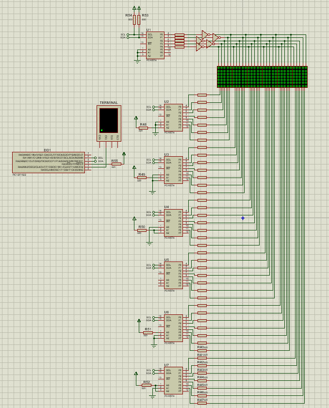

# Контроллер матричного индикатора

Реализация контроллера шестиразрядного матричного индикатора 5х7 на PIC12F1840.
Выбор режима и ввод отоброжаемой последовательности происходит по UART через виртуальный терминал VT100.

Реализованные режимы:
- бегущая строка (размер входной последовательности может быть до 12);
- мигание;
- часы (начальное задание по паттерну `:mm:ss`);

Так как число пинов для PIC-микроконтроллеров 12-ой серии невилико, принято решение 
использовать расширители PCF7584 для передачи последовательностей на матричные индикаторы 
по протоколу I2C. Индикация динамическая.

